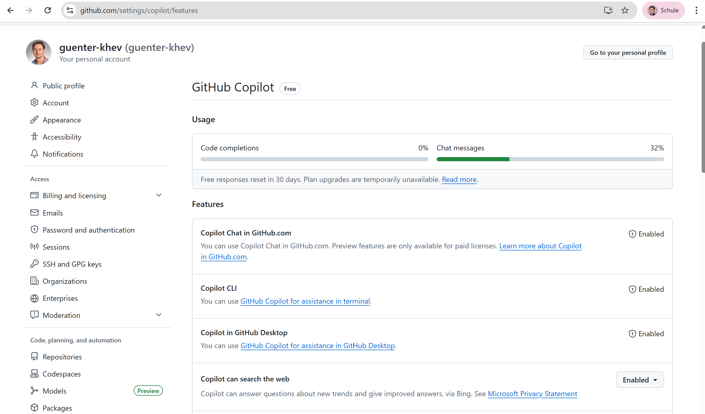

# 3. GitHub Copilot — Schüler-Zugang

[← Onboarding-Übersicht](index.md) | [Hauptseite](../index.md)

---

## 3.1 Copilot-Status prüfen

1. Öffne https://github.com/settings/copilot/features
2. Oben siehst du deinen Plan (z.B. **Free** oder **Pro**)
3. Unter **Features** muss stehen:
   - **Copilot Chat in GitHub.com** → ✅ Enabled
   - **Copilot CLI** → ✅ Enabled
   - **Copilot in GitHub Desktop** → ✅ Enabled
4. Unter **Usage** siehst du dein verbleibendes Kontingent (Code completions / Chat messages)

## 3.2 Kostenlosen Student-Zugang beantragen

Als Schüler bekommst du **GitHub Copilot kostenlos** über GitHub Education:

1. Öffne https://education.github.com/pack
2. Klick auf **„Sign up for Student Developer Pack"**
3. Mit GitHub-Account anmelden
4. Schul-Nachweis hochladen, z.B.:
   - Foto deines **Schülerausweises** (gültig, mit Datum)
   - oder eine **Schulbestätigung** (PDF)
   - oder die **Schul-E-Mail** (`@khev.at`) verifizieren
5. Antrag absenden → Bestätigung kommt per E-Mail (meist 1–7 Tage)
6. Nach Freischaltung: Copilot ist automatisch in deinem Account aktiv

> **Tipp:** Nutze deine Schul-E-Mail — das beschleunigt die Prüfung deutlich.

---

**Vorheriger Schritt:** [← 2. Projekt einrichten](02-projekt.md)
**Nächster Schritt:** [4. Claude Haiku 4.5 →](04-claude.md)
